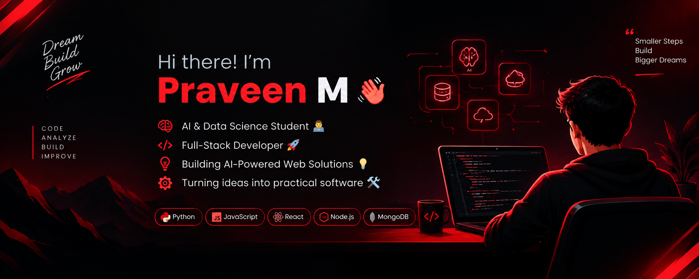
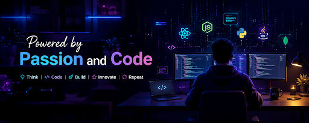

  

  

  
  

<h2 align="center">🔴 About Me</h2>

  

  

  Hey! I'm <b>Praveen M</b>, an <b>Artificial Intelligence & Data Science student</b> at <b>Erode Sengunthar Engineering College</b>, Tamil Nadu, India. 
  I am passionate about full-stack web development and building AI-powered web solutions that solve practical real-world problems.

  
  
  
  

  💬 <b>Let's Discuss:</b> Python, C, Java, JavaScript, React, MySQL, Web Development & AI Applications. 
  ⚡ <b>Philosophy:</b> <i>"Turning ideas into practical, reliable, and impact-driven software!"</i>

<table width="100%" border="0" align="center">
  <tr>
    <td width="50%" align="center" style="padding: 14px;">
      <h4>🎓 Education</h4>
      
<b>B.Tech AI & Data Science</b> Erode Sengunthar Engineering College

    </td>
    <td width="50%" align="center" style="padding: 14px;">
      <h4>🚀 Career Goal</h4>
      
<b>Full-Stack Developer</b> Building Web & AI Solutions

    </td>
  </tr>
  <tr>
    <td width="50%" align="center" style="padding: 14px;">
      <h4>💡 Core Focus</h4>
      
<b>AI & Web Applications</b> Practical Software & Data Insights

    </td>
    <td width="50%" align="center" style="padding: 14px;">
      <h4>🤝 Collaboration</h4>
      
<b>Web & AI Projects</b> Open to exciting developer collaborations

    </td>
  </tr>
</table>

<h2 align="center">🔴 Featured Projects</h2>

<table width="100%" border="0" align="center">
  <tr>
    <td align="center" style="padding: 20px;">
      <h3>💳 Lend Easy</h3>
      
<i>A loan/CAM workflow web application for managing loan applications, financial analysis, credit decisions, and CAM reports.</i>

      
<b>Key Features:</b> Loan Application • Workflow Pipeline • Financial Analysis • Credit Decision • CAM Report • EMI Calculator • Risk Score • Loan Exposure • Profit Margin • Debt/Equity Analysis

      

        
        
        
        
      

    </td>
  </tr>
  <tr>
    <td align="center" style="padding: 20px;">
      <h3>🧠 NovaMind</h3>
      
<i>An AI-supported emotional safety and anti-bullying platform designed around anonymous student reporting, mood check-ins, student support, and counselor workflows.</i>

      
<b>Key Features:</b> Anonymous Reports • Mood Check-ins • AI Support Chatbot • Counselor Dashboard • Risk/Priority Insights • Student/Counselor Communication • Privacy-Focused Reporting

      

        
        
        
        
      

    </td>
  </tr>
  <tr>
    <td align="center" style="padding: 20px;">
      <h3>🌊 Urban Flood Nowcasting System</h3>
      
<i>A flood nowcasting system focused on rainfall data, drainage coupling, and street-level urban inundation prediction.</i>

      
<b>Key Features:</b> Rainfall Data Processing • Drainage Coupling • Flood Depth Calculation • Street-Level Urban Flood Visualization • Short-Term Nowcasting

      

        
        
        
        
      

    </td>
  </tr>
</table>

<h2 align="center">🛠️ Tech Stack & Skills</h2>

<b>Programming Languages</b>

  

<b>Frontend Development</b>

  

<b>Database & Tools</b>

  

  
  
  
  
  
  
  
  
  
  
  
  
  
  

<h2 align="center">📊 GitHub Analytics & Activity</h2>

  
  

  

<h2 align="center">⚡ Contribution Journey</h2>

  

<h2 align="center">📬 Let's Connect & Collaborate</h2>

<i>Whether you want to discuss AI, explore web development projects, or just say hello — my inbox and profile are always open!</i>

  

  

