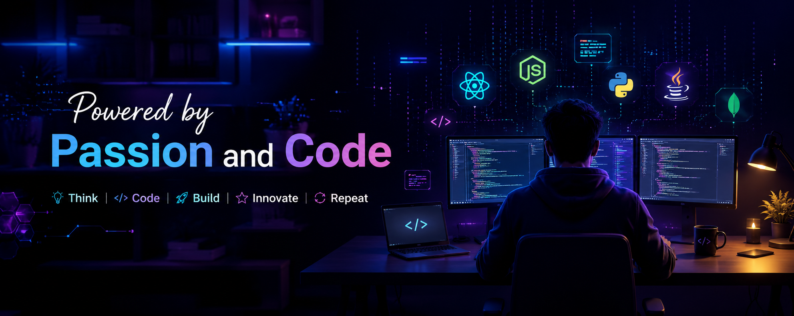

<!-- ═════════  ══════════════════════════════════════════════════════ -->
<!-- 🌌 PRAVEEN MARAPPAN — PREMIUM GITHUB PROFILE README 🌌 -->
<!-- ═══════════════════════════════════════════════════════════════ -->

<!-- 🌊 WAVE HEADER -->

  

<!-- 🌈 FAST ANIMATED TYPING INTRO -->

  

<!-- 👋 ANIMATED WELCOME BANNER -->

  
  <b>Welcome to My World of Innovation</b>
  

  
  
  

<!-- 🌈 DIVIDER -->

<!-- 💻 CODING GIF + ABOUT ME -->
<table align="center" border="0">
  <tr>
    <td width="55%" valign="top">
      <h2>
        
        &nbsp;About Me
      </h2>
      

        🎓 &nbsp;<b>AI & Data Science</b> student at 
        &nbsp;&nbsp;&nbsp;&nbsp;<b>Erode Sengunthar Engineering College</b>  
        🌏 &nbsp;Based in <b>Tamil Nadu, India</b> 🇮🇳  
        💼 &nbsp;<b>Web Designer Intern</b> @ <b>Elevado Softwares</b> 
        &nbsp;&nbsp;&nbsp;&nbsp;<i>June 15, 2026 → July 15, 2026</i>  
        🚀 &nbsp;Passionate about building <b>Full Stack</b> & <b>AI</b> products  
        💬 &nbsp;Ask me about <b>React, Node.js, Python & ML</b>  
        ⚡ &nbsp;Fun fact: <i>I debug faster with lo-fi music 🎧</i>
      

    </td>
    <td width="45%" valign="middle" align="center">
      
    </td>
  </tr>
</table>

<!-- 🌈 DIVIDER -->

<!-- 🛠 TECH STACK -->
<h2 align="center">
  &nbsp;
</h2>

<b>💻 Languages</b>

  

<b>🎨 Frontend</b>

  

<b>⚙️ Backend</b>

  

<b>🗄️ Database</b>

  

<b>🧰 Tools</b>

  

  
  
  
  
  
  
  
  
  
  

<!-- 🌈 DIVIDER -->

<!-- 📊 GITHUB STATS -->
<h2 align="center">
  &nbsp;
</h2>

  
  

  
  

<!-- 🌈 DIVIDER -->

<!-- 🌟 FEATURED PROJECTS -->
<h2 align="center">
   &nbsp;
</h2>

  
  

  

<!-- 📚 CURRENTLY LEARNING -->
<h2 align="center">
   &nbsp;
</h2>

  
  
  
  

  
  
  

<!-- 🎯 2026 GOALS -->
<h2 align="center">
  &nbsp;
</h2>

<table align="center">
  <tr>
    <td>✅ Become an excellent <b>Full Stack Developer</b></td>
    <td>✅ Master the <b>MERN Stack</b></td>
  </tr>
  <tr>
    <td>🤖 Build production-grade <b>AI Products</b></td>
    <td>🌍 Contribute to <b>Open Source</b></td>
  </tr>
  <tr>
    <td colspan="2" align="center">🏢 Land a role at a <b>Top Product Company</b></td>
  </tr>
</table>

<!-- 💬 QUOTE -->
<h2 align="center">
   &nbsp;
</h2>

  

<!-- ☕ FUN FACTS -->
<h2 align="center">
  &nbsp;
</h2>

  🌙 &nbsp;I code better at <b>night</b> under <b>neon lights</b> 
  ☕ &nbsp;Fueled by <b>chai + coffee + curiosity</b> 
  🎧 &nbsp;<b>Lo-fi beats</b> is my debugger 
  🧩 &nbsp;I love solving <b>tricky logic puzzles</b> 
  🚀 &nbsp;Dream: build a product used by <b>millions</b>

<!-- 🌈 DIVIDER -->

<!-- 🌐 CONNECT -->
<h2 align="center">
   &nbsp;
</h2>

  
  
  
  

<!-- ⚡ SNAKE / CONTRIBUTION -->

  

<!-- 🌊 WAVE FOOTER -->

  

  <i>⭐ From <b>Praveen Marappan</b> — Keep Building, Keep Shipping 🚀</i>

